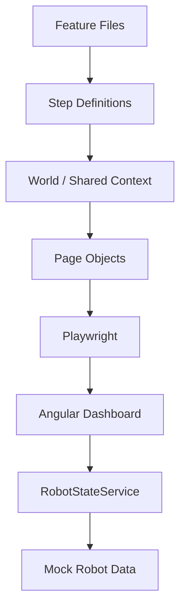

```mermaid
graph TD
    A[Feature Files] --> B[Step Definitions]
    B --> C[World / Shared Context]
    C --> D[Page Objects]
    D --> E[Playwright]
    E --> F[Angular Dashboard]
    F --> G[RobotStateService]
    G --> H[Mock Robot Data]
```